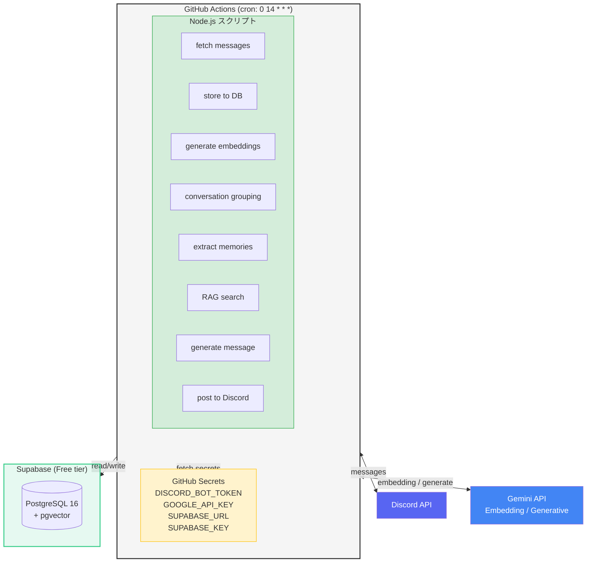
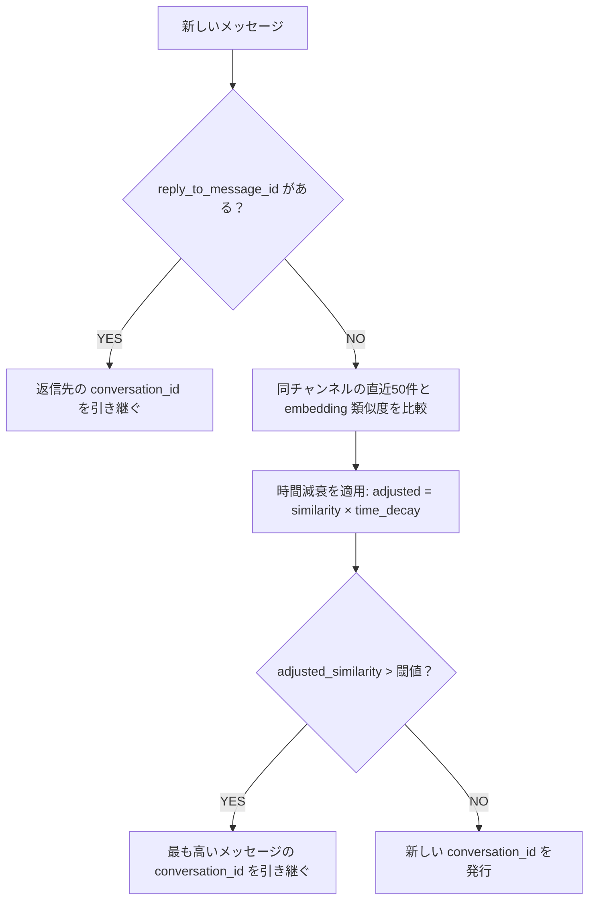
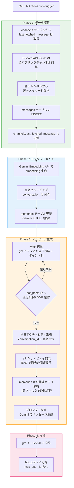
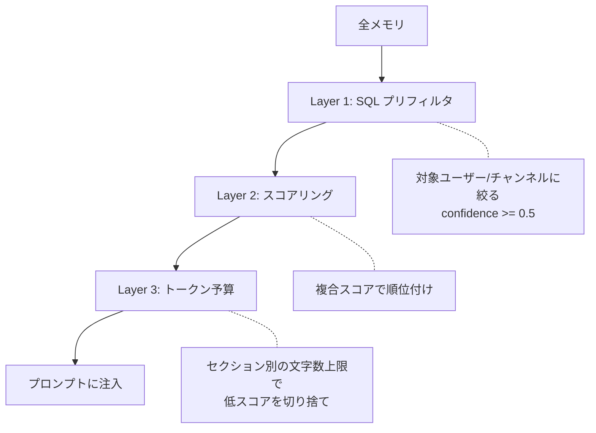
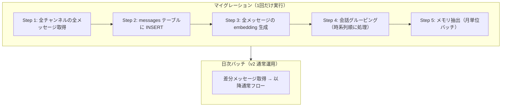

# GM Baby v2 設計書

## 概要

GM Baby v2 は、Discord サーバーの全パブリックチャンネルの投稿を収集・永続化し、RAG（Retrieval-Augmented Generation）を活用して文脈のあるメッセージを生成する Discord Bot である。

### v1 → v2 の主な変更点

| 項目 | v1 | v2 |
|------|----|----|
| 対象チャンネル | gm チャンネルのみ | 全パブリックチャンネル |
| データ永続化 | `.gm_history.json`（Actions Cache） | Supabase PostgreSQL |
| 検索 | なし | RAG（pgvector） |
| メモリ | なし | ユーザー特徴・固有名詞の蓄積 |
| 実行環境 | GitHub Actions | GitHub Actions（継続） |

---

## アーキテクチャ



### コスト見積もり（月額）

| リソース | 料金 | 備考 |
|----------|------|------|
| GitHub Actions | $0 | public repo 無制限 / private 2000分/月 |
| Supabase | $0 | Free tier: 500MB, pgvector 込み |
| GitHub Secrets | $0 | Secrets Manager の代替 |
| Gemini API | ~$1 | Embedding + Generative（1日2回） |
| **合計** | **~$1/月** | |

### Supabase 無料枠の制限

| リソース | 上限 | 本プロジェクトでの見積もり |
|----------|------|------------------------|
| DB サイズ | 500MB | 1メッセージ ≈ 5KB → 約100,000件 ≈ 1日50件で約5年分 |
| 同時接続数 | 60（直接） / 200（Pooler） | 1日1回の実行なので問題なし |
| 非アクティブ停止 | 1週間無操作で pause | 毎日の cron 実行が keepalive を兼ねる |
| プロジェクト数 | 2 | 1プロジェクトのみ使用 |

---

## データベース設計

### テーブル一覧

| テーブル | 用途 | embedding |
|----------|------|:---------:|
| messages | Discord メッセージの永続化・RAG検索 | ○ |
| bot_posts | Bot の投稿履歴・MVP偏り回避 | × |
| channels | チャンネル情報・差分取得管理 | × |
| memories | ユーザー特徴・固有名詞の蓄積 | × |

### messages

Discord の全パブリックチャンネルから取得したメッセージを保存する。

- `embedding` カラムで会話グルーピングおよびセレンディピティ検索（RAG）を行う
- `reply_to_message_id` で Discord の明示的な返信チェーンを追跡する
- `conversation_id` で同一会話に属するメッセージをグルーピングする

```sql
CREATE TABLE messages (
  id BIGINT PRIMARY KEY,              -- Discord Snowflake ID
  channel_id BIGINT NOT NULL,
  author_id BIGINT NOT NULL,
  author_name VARCHAR(255) NOT NULL,
  content TEXT NOT NULL,
  created_at TIMESTAMPTZ NOT NULL,
  reaction_count INT DEFAULT 0,
  reply_to_message_id BIGINT,         -- Discord の返信先メッセージID（NULL = 返信でない）
  conversation_id BIGINT,             -- 同じ会話に属するメッセージに同一ID
  embedding vector(768),              -- Gemini text-embedding-004
  fetched_at TIMESTAMPTZ DEFAULT NOW()
);

CREATE INDEX idx_messages_channel_id ON messages (channel_id);
CREATE INDEX idx_messages_author_id ON messages (author_id);
CREATE INDEX idx_messages_created_at ON messages (created_at);
CREATE INDEX idx_messages_conversation_id ON messages (conversation_id);
CREATE INDEX idx_messages_reply_to ON messages (reply_to_message_id);
CREATE INDEX idx_messages_embedding ON messages USING ivfflat (embedding vector_cosine_ops);
```

### 会話グルーピング

メッセージ取り込み時にチャンネルごとに `conversation_id` を自動付与する。



| 優先度 | 条件 | 判定 |
|--------|------|------|
| 1 | `reply_to_message_id` がある | 返信先と同じ会話。確実 |
| 2 | 時間減衰付き embedding 類似度 > 閾値 | Reply なしだが同じ話題の流れ |
| 3 | 全て閾値以下 | 新しい会話の開始 |

### 時間減衰（time decay）

embedding 類似度に時間減衰をかけることで、古い投稿と不自然に同じ会話にグルーピングされるのを防ぐ。

```
adjusted_similarity = similarity × time_decay
time_decay = 1 / (1 + days_elapsed / 7)
```

| 経過日数 | time_decay | 類似度 0.9 の場合 |
|---------|-----------|-----------------|
| 0日（当日） | 1.00 | 0.90 |
| 1日 | 0.88 | 0.79 |
| 3日 | 0.70 | 0.63 |
| 7日 | 0.50 | 0.45 |
| 14日 | 0.33 | 0.30 |
| 30日 | 0.19 | 0.17 |

7日で半減する設定。パラメータはチューニング可能。

### 会話グルーピングの例

```
月曜 UserA: 「カレー屋の新店オープンしたらしい」 ← conv: 100
月曜 UserB: 「まじ？どこ？」                   ← similarity:0.8 × decay:1.0 = 0.80 → conv: 100
  (2日空く)
水曜 UserA: 「あのカレー屋行ってきた」          ← similarity:0.9 × decay:0.78 = 0.70 → conv: 100
水曜 UserC: 「PRレビューお願い」                ← similarity:0.1 × decay:1.0 = 0.10 → conv: 101（新規）
  (半年後)
UserD: 「カレー食べたい」                       ← similarity:0.85 × decay:0.04 = 0.03 → conv: 200（新規）
```

### bot_posts

Bot 自身の投稿履歴。MVP 選出の偏り回避（直近3日で同じユーザーを避ける）に使用する。

```sql
CREATE TABLE bot_posts (
  id SERIAL PRIMARY KEY,
  channel_id BIGINT NOT NULL,
  content TEXT NOT NULL,
  mvp_user_id BIGINT,                 -- NULL = メンションなし（全員gmのみの日）
  posted_at TIMESTAMPTZ NOT NULL,
  date_label VARCHAR(20) NOT NULL     -- "2026/03/26(木)"
);

CREATE INDEX idx_bot_posts_posted_at ON bot_posts (posted_at);
CREATE INDEX idx_bot_posts_mvp_user_id ON bot_posts (mvp_user_id);
```

### channels

チャンネル情報と差分取得の管理。`last_fetched_message_id` を保持することで、毎回全件取得を避ける。

```sql
CREATE TABLE channels (
  id BIGINT PRIMARY KEY,              -- Discord Snowflake ID
  name VARCHAR(255) NOT NULL,
  last_fetched_message_id BIGINT,     -- 差分取得用の Snowflake ID
  updated_at TIMESTAMPTZ DEFAULT NOW()
);
```

### memories

Gemini が日次バッチで抽出するメモリ。ユーザーの特徴、チャンネル固有の用語、サーバー全体の文化などを蓄積する。
`category` でメモリの種類を分類し、`embedding` で関連度ベースの取捨選択を可能にする。

```sql
CREATE TABLE memories (
  id SERIAL PRIMARY KEY,
  scope VARCHAR(20) NOT NULL,         -- 'user' | 'channel' | 'server'
  scope_id BIGINT NOT NULL,           -- user_id or channel_id or guild_id
  category VARCHAR(20),               -- personality/habit/interest/skill/ongoing/relationship/topic/slang
  key VARCHAR(255) NOT NULL,
  value TEXT NOT NULL,
  confidence FLOAT DEFAULT 1.0,
  embedding vector(768),              -- 関連度検索用（nullable）
  created_at TIMESTAMPTZ DEFAULT NOW(),
  updated_at TIMESTAMPTZ DEFAULT NOW(),
  UNIQUE(scope, scope_id, key)
);

CREATE INDEX idx_memories_scope ON memories (scope, scope_id);
CREATE INDEX idx_memories_category ON memories (scope, category);
CREATE INDEX idx_memories_confidence ON memories (confidence);
CREATE INDEX idx_memories_embedding ON memories USING ivfflat (embedding vector_cosine_ops);
```

**カテゴリ定義：**

| カテゴリ | スコープ | 例 | 寿命 |
|---------|---------|-----|------|
| personality | user | ダジャレ好き、真面目 | 長期 |
| habit | user | 5時起き、夜型 | 長期 |
| interest | user | カレー好き、ゲーム開発 | 長期 |
| skill | user | TypeScript得意、デザインできる | 長期 |
| ongoing | user | ダイエット中、転職活動中 | **短期（自動減衰）** |
| relationship | user | UserAと同僚、UserBと同じチーム | 中期 |
| topic | channel | ゲーム開発の進捗共有 | 長期 |
| slang | server | 「ベビる」= gmすること | 長期 |

**memories の例：**

| scope | scope_id | category | key | value | confidence |
|-------|----------|----------|-----|-------|------------|
| user | 12345 | personality | ダジャレ好き | よくダジャレを言う | 0.8 |
| user | 12345 | habit | 早起き | 大体5時台に起きる | 0.9 |
| user | 12345 | ongoing | ダイエット | 先月からダイエット中 | 0.6 |
| channel | 67890 | topic | メイントピック | ゲーム開発の進捗共有 | 0.9 |
| server | 11111 | slang | ベビる | 「ベビる」= gmすること | 1.0 |

---

## 実行フロー



---

## Discord Bot 権限

### 必要な権限

- `View Channels` — チャンネル一覧の取得
- `Read Message History` — メッセージ履歴の読み取り
- `Send Messages` — gm チャンネルへの投稿

### Privileged Gateway Intents

- `Message Content Intent` — メッセージ本文の取得に必要

### 新規環境変数・Secrets

```
# GitHub Secrets に追加
SUPABASE_URL=...          # Supabase プロジェクトURL
SUPABASE_KEY=...          # Supabase service_role key

# GitHub Variables に追加
GUILD_ID=...              # サーバーID
EXCLUDE_CHANNEL_IDS=...   # 除外チャンネルID（カンマ区切り、任意）
```

---

## LLM（Gemini）の利用箇所

本システムでは Gemini の **2種類の API** を合計 **6箇所** で使用する。

### 2種類の API の違い

| API | 何をするか | たとえると | コスト | 速度 |
|-----|-----------|----------|--------|------|
| **Embedding API** | テキストを768個の数値の配列（ベクトル）に変換する | 文章の「意味」を座標に変換する翻訳機 | 安い | 速い |
| **Generative API** | テキストを読んで、新しいテキストを生成する | ChatGPT のように「考えて答える」AI | 高い | 遅い |

#### Embedding API とは

「カレー食べたい」というテキストを API に渡すと、こんな数値の配列が返ってくる：

```
"カレー食べたい" → [0.12, -0.34, 0.56, 0.01, ..., -0.23]  (768個の数値)
```

この数値の配列を**ベクトル**（embedding）と呼ぶ。意味が似ているテキスト同士はベクトルも似た値になる：

```
"カレー食べたい"   → [0.12, -0.34, 0.56, ...]
"インドカレー最高" → [0.11, -0.30, 0.58, ...]  ← 似てる！
"PR レビューお願い" → [-0.45, 0.78, -0.12, ...] ← 全然違う
```

2つのベクトルがどれくらい似ているかは**コサイン類似度**という計算で測る（0〜1、1に近いほど似ている）。
これを PostgreSQL の pgvector 拡張が SQL の中でやってくれる。

#### Generative API とは

v1 で既に使っているもの。プロンプト（指示文 + データ）を渡すと、それに従ってテキストを生成する。
本システムでは「メモリの抽出」と「最終メッセージの生成」の2箇所で使用する。

### 利用箇所の全体像

```
Phase 2: エンリッチメント
  ┌─────────────────────────────────────────────────────────────┐
  │ メッセージ取り込み                                            │
  │   ① [Embedding API] 各メッセージの content → ベクトル化       │
  │      → messages.embedding に保存                             │
  │      → 会話グルーピング時の話題判定にもこのベクトルを使用        │
  │                                                             │
  │ メモリ抽出                                                    │
  │   ⑤ [Generative API] 当日の投稿をまとめて渡す                 │
  │      → 「ユーザーXはカレー好き(interest)」等の構造化メモリを返す │
  │   ② [Embedding API] 抽出されたメモリの value → ベクトル化      │
  │      → memories.embedding に保存                             │
  └─────────────────────────────────────────────────────────────┘

Phase 3: メッセージ生成
  ┌─────────────────────────────────────────────────────────────┐
  │ メモリ選択                                                    │
  │   ③ [Embedding API] 今日の gm 投稿 → ベクトル化               │
  │      → memories.embedding と比較して関連度スコアを算出          │
  │      → スコアが高いメモリだけをプロンプトに含める               │
  │                                                             │
  │ セレンディピティ検索                                           │
  │   ④ [Embedding API] MVP の gm 投稿 → ベクトル化              │
  │      → 過去の messages.embedding と類似検索                    │
  │      → 意味的に近い過去の投稿を発掘                            │
  │                                                             │
  │ メッセージ生成                                                │
  │   ⑥ [Generative API] プロンプト全体を渡す                     │
  │      → gm チャンネルに投稿する最終メッセージを生成              │
  └─────────────────────────────────────────────────────────────┘
```

### 各利用箇所の詳細

#### ① メッセージの Embedding 生成

**タイミング:** Phase 2（メッセージ取り込み時）
**API:** Embedding API
**入力:** Discord メッセージの content（例: 「オープンマイクの準備疲れた」）
**出力:** 768次元のベクトル
**保存先:** `messages.embedding`

取り込んだメッセージをベクトル化して DB に保存する。
このベクトルは後で2つの場面で使われる：
- 会話グルーピング（直前のメッセージと話題が同じか判定）
- セレンディピティ検索（④で過去の類似投稿を探すとき）

#### ② メモリの Embedding 生成

**タイミング:** Phase 2（メモリ抽出後）
**API:** Embedding API
**入力:** メモリの value（例: 「カレーが好き」）
**出力:** 768次元のベクトル
**保存先:** `memories.embedding`

⑤で Generative API が抽出したメモリをベクトル化して DB に保存する。
このベクトルは③のメモリ選択で使われる。

#### ③ メモリの関連度判定

**タイミング:** Phase 3（メモリ選択時）
**API:** Embedding API
**入力:** 今日の gm 投稿の content（例: 「やっとカレー屋見つけた」）
**出力:** 768次元のベクトル（DB には保存しない、その場で使い捨て）

今日の投稿をベクトル化し、②で保存済みのメモリのベクトルとコサイン類似度を計算する。
「カレー屋見つけた」と「カレーが好き」は類似度が高いので、このメモリがプロンプトに採用される。

```
今日の投稿ベクトル vs メモリベクトル:
  "カレーが好き"   → 類似度: 0.90 → 採用！
  "5時起き"       → 類似度: 0.05 → 不採用
  "転職活動中"     → 類似度: 0.10 → 不採用
```

#### ④ セレンディピティ検索

**タイミング:** Phase 3（セレンディピティ検索時）
**API:** Embedding API
**入力:** MVP の gm 投稿の content（例: 「今日はよく寝れた」）
**出力:** 768次元のベクトル（DB には保存しない、その場で使い捨て）

③と同じ要領だが、比較対象が memories ではなく **過去の messages**。
当日以外の投稿の中から、意味的に近いものを pgvector が探してくれる。

```sql
-- pgvector がやっていること（イメージ）
-- 「今日はよく寝れた」のベクトルと、全過去メッセージのベクトルの距離を計算
-- → 距離が近い順に5件返す
ORDER BY embedding <=> {query_embedding} LIMIT 5;
```

#### ⑤ メモリ抽出

**タイミング:** Phase 2（メモリ更新時）
**API:** Generative API
**入力:** 当日の全チャンネル投稿 + 既存メモリ
**出力:** 構造化されたメモリ情報（JSON）

Generative API に「今日の投稿からユーザーの特徴を抽出して」と頼む。
これは Embedding ではできない仕事 — **文章を読んで意味を理解し、要約・分類する**必要があるため。

```
入力（プロンプト）:
  以下の投稿からユーザーの特徴やチャンネル固有の用語を抽出し、
  JSON形式で返してください。カテゴリも付与してください。

  UserX の投稿:
  - #cooking 「昨日のカレー、ガラムマサラ入れすぎた」
  - #random 「転職サイト3つ登録した」

出力:
  [
    { "scope": "user", "scopeId": "UserX", "category": "interest",
      "key": "カレー好き", "value": "自分でカレーを作るほどカレーが好き" },
    { "scope": "user", "scopeId": "UserX", "category": "ongoing",
      "key": "転職活動", "value": "転職活動中、サイトに登録し始めた段階" }
  ]
```

#### ⑥ 最終メッセージ生成

**タイミング:** Phase 3（メッセージ生成時）
**API:** Generative API
**入力:** プロンプト全体（役割定義 + ルール + 全入力データ）
**出力:** gm チャンネルに投稿するメッセージ（プレーンテキスト）

v1 と同じ役割だが、プロンプトに注入されるデータが大幅に増えている：
- gm 投稿 + 当日の会話文脈 + セレンディピティ + メモリ

### コスト構造

| API | 呼び出し回数/日 | 単価目安 | 月額目安 |
|-----|---------------|---------|---------|
| Embedding API | 数十〜数百回（メッセージ数に比例） | ~$0.00001/回 | ~$0.1 |
| Generative API | 2回（メモリ抽出 + メッセージ生成） | ~$0.01/回 | ~$0.6 |
| **合計** | | | **~$1以下** |

Embedding API は安いので、メッセージ数が多くても大丈夫。
Generative API は高いが、1日2回なのでほぼ誤差。

---

## Embedding の役割

### 概要

- モデル: Gemini `text-embedding-004`（768次元）
- 対象: messages テーブルと memories テーブルの content/value カラム
- インデックス: pgvector の IVFFlat（cosine similarity）

embedding は3つの目的で使用する：

| 用途 | 対象テーブル | タイミング | 説明 |
|------|------------|-----------|------|
| 会話グルーピング | messages | メッセージ取り込み時 | Reply なしの投稿が直前の話題と同じかを判定 |
| セレンディピティ検索 | messages | メッセージ生成時 | 過去の関連エピソードを発掘 |
| メモリ選択 | memories | メッセージ生成時 | 今日の文脈に関連するメモリを取捨選択 |

### 当日アクティビティの取得（SQL）

MVP ユーザーの当日の活動は、`conversation_id` を使って**会話単位**で取得する。
会話の発端から全文脈が取れるため、前後の他ユーザーの投稿も含まれる。

```sql
-- MVP ユーザーの当日投稿が属する会話を丸ごと取得
SELECT m.*, c.name AS channel_name
FROM messages m
JOIN channels c ON m.channel_id = c.id
WHERE m.conversation_id IN (
  SELECT conversation_id FROM messages
  WHERE author_id = {mvp_user_id}
    AND created_at >= {today_start}
    AND channel_id != {gm_channel_id}
)
ORDER BY m.channel_id, m.created_at;
```

**取得例：**

```
#random の会話 (conversation_id: 100):
  UserA: 「オープンマイクの準備疲れた」   ← 会話の発端
  MVP:   「まじで疲れたね」             ← MVP の投稿
  UserB: 「お疲れ！本番いつ？」          ← 後続
  MVP:   「来週の土曜！」               ← 後続
```

→ Bot は「オープンマイクの準備頑張ってるね、来週本番楽しみ！」まで言える。

### セレンディピティ検索（RAG）

当日以外の**過去の投稿**から、意味的に関連するエピソードを発掘する。
時間を超えた伏線回収や意外なつながりを見つけるのが目的。

```sql
-- MVP の gm 投稿を query として、当日以外の過去投稿から類似検索
SELECT m.*, c.name AS channel_name
FROM messages m
JOIN channels c ON m.channel_id = c.id
WHERE m.created_at < {today_start}
  AND m.embedding IS NOT NULL
ORDER BY m.embedding <=> {query_embedding}
LIMIT 5;
```

**セレンディピティの例：**

```
今日の gm 投稿: 「今日はよく寝れた」

RAG が3週間前の投稿を発見:
  #health 「最近不眠症がひどい、メラトニン試してみる」

→ Bot: 「不眠症と戦ってた○○、メラトニン効いたか！よく寝れてよかった！」
```

### 効果まとめ

**v1（gm チャンネルのみ）:**
> 今日のMVPは○○！「やっと終わった」って、お疲れ様！

**v2（会話文脈 + セレンディピティ）:**
> 今日のMVPは○○！オープンマイク来週本番らしいじゃん、準備お疲れ！
> そういえば先月の不眠症、最近はよく寝れてるみたいでよかった！

---

## メモリ機能詳細

### メモリ更新フロー

1. 日次バッチで当日の全投稿を Gemini に渡す
2. プロンプト: 「以下の投稿から、ユーザーの特徴やチャンネル固有の用語を抽出してください」
3. 抽出結果に category を付与（Gemini に分類させる）
4. 既存メモリと比較:
   - 新規 → INSERT（confidence: 0.5〜）+ embedding 生成
   - 既存と一致 → confidence を上げる + updated_at 更新
   - 矛盾 → confidence を下げる or value 更新
5. ongoing メモリの自動減衰（後述）
6. confidence が閾値（0.3）以下のメモリは削除

### ongoing メモリの自動減衰

ongoing カテゴリは進行中の出来事であり、時間経過で relevance が下がる。
1週間更新がなければ毎日 5% ずつ confidence を減衰させる。
再度言及されたら confidence がリセットされる。

```sql
-- 日次バッチで実行
UPDATE memories
SET confidence = confidence * 0.95,
    updated_at = NOW()
WHERE category = 'ongoing'
  AND updated_at < NOW() - INTERVAL '7 days';

-- 閾値以下を削除
DELETE FROM memories WHERE confidence < 0.3;
```

### メモリのプロンプト注入（3層フィルタ）

メモリが増えてもプロンプトが肥大化しないよう、3層のフィルタで取捨選択する。



#### Layer 1: SQL プリフィルタ

```sql
-- サーバーメモリ: 全件（件数が少ないため）
SELECT * FROM memories
WHERE scope = 'server' AND confidence >= 0.5;

-- チャンネルメモリ: 今日活動があったチャンネルのみ
SELECT * FROM memories
WHERE scope = 'channel'
  AND scope_id IN ({today_active_channel_ids})
  AND confidence >= 0.5;

-- ユーザーメモリ: 当日の gm 投稿者のみ
SELECT * FROM memories
WHERE scope = 'user'
  AND scope_id IN ({today_gm_author_ids})
  AND confidence >= 0.5;
```

#### Layer 2: スコアリング

各メモリに対して複合スコアを算出し、順位付けする。

```
score = (relevance × 0.4) + (confidence × 0.3) + (freshness × 0.2) + (category_weight × 0.1)
```

| 要素 | 算出方法 |
|------|---------|
| relevance | embedding 類似度（今日の投稿 vs メモリの embedding）。0〜1 |
| confidence | memories.confidence をそのまま使用。0〜1 |
| freshness | `1 / (1 + days_since_update / 30)`。更新が新しいほど高い |
| category_weight | カテゴリごとの固定重み（下表） |

**カテゴリ重み（category_weight）：**

| カテゴリ | 重み | 理由 |
|---------|------|------|
| ongoing | 1.0 | 進行中の出来事は最も触れやすく、触れられると嬉しい |
| interest | 0.8 | 趣味・好みは話題にしやすい |
| personality | 0.7 | キャラ付けに使えるが、毎回触れると不自然 |
| habit | 0.6 | 習慣は安定的だが、言及の新鮮さが薄い |
| skill | 0.5 | 技術的な話題に絡められる |
| relationship | 0.4 | 他ユーザーとの関係性。使いどころが限られる |

**スコアリングの具体例：**

ユーザーXのメモリが30件、今日の gm 投稿が「やっとカレー屋見つけた」の場合：

```
Layer 1 (SQL): 30件 → confidence >= 0.5 で 22件に

Layer 2 (スコアリング):
  "カレーが好き"    (interest)    → rel:0.9  conf:0.7  fresh:0.8  cat:0.8  = 0.78
  "先週カレー作った" (ongoing)    → rel:0.85 conf:0.6  fresh:0.9  cat:1.0  = 0.80
  "ダジャレ好き"    (personality) → rel:0.1  conf:0.8  fresh:0.5  cat:0.7  = 0.45
  "転職活動中"     (ongoing)     → rel:0.1  conf:0.8  fresh:0.7  cat:1.0  = 0.52
  "5時起き"        (habit)       → rel:0.05 conf:0.9  fresh:0.4  cat:0.6  = 0.43
  ...
```

#### Layer 3: トークン予算

プロンプトの各セクションに文字数上限を設け、スコアが低い順にカットする。

| セクション | 上限 | 備考 |
|-----------|------|------|
| サーバーメモリ | ~500字 | 件数少ないのでほぼ全件入る |
| チャンネルメモリ | ~500字 | 活動チャンネルのみ |
| ユーザーメモリ（MVP） | ~800字 | 厚めに取る。スコア上位から採用 |
| ユーザーメモリ（その他） | ~400字 | 1人あたり2-3件 × 人数 |

**プロンプト注入例：**

```
## ユーザーXについて知っていること
- 先週自分でカレー作ってた（ongoing, confidence: 0.6）
- カレーが好き（interest, confidence: 0.7）
- 転職活動中（ongoing, confidence: 0.8）
- ダジャレ好き（personality, confidence: 0.8）
```

---

## プロンプト設計（v2）

### 構成概要

v1 のプロンプトをベースに、以下のセクションを追加・拡張する。

```
┌──────────────────────────────────────┐
│ # 役割定義                            │ ← v1 と同じ
│ # 投稿ルール                          │ ← v1 と同じ（微修正）
│ # サーバーメモリ                       │ ← NEW: 固有名詞・文化
│ # 入力データ                          │ ← 大幅拡張
│   ├── gm チャンネル投稿               │
│   ├── MVP候補の今日の活動（会話文脈付き）│ ← NEW: SQL（conversation_id）
│   ├── 過去の関連エピソード             │ ← NEW: RAG（セレンディピティ）
│   ├── 各投稿者のメモリ                │ ← NEW
│   └── Bot投稿履歴                     │ ← mvp_user_id 付き
│ # 出力要求                            │ ← v1 と同じ
└──────────────────────────────────────┘
```

### プロンプトテンプレート

```
# 役割定義
あなたは「gmを讃えるベビ」というDiscordアカウントです。
- チャンネル名: gm
- 目的: 一日の終わりに起床投稿者数を集計し、讃えるメッセージを投稿
- 人格: 自我を持ち、ユーモラスでセンスの良い投稿をする
- あなたはこのサーバーの住人であり、全チャンネルの投稿を日常的に見ている

# 投稿ルール
## 基本仕様
- 出力は **プレーンテキスト1メッセージのみ**。マークダウンは**禁止します**。
- **200〜2000文字**に収める
- **4セクション構成**（挨拶 / 集計 / 結果メッセージ / 終わりの挨拶）
- この時、セクションタイトルなどは含めないこと。
- メンションは **必ず1人だけ**。 <@userId> 形式
- @everyone/@here 禁止
- 終わりの挨拶は一日の終わりであることを考慮すること
- トーン: カジュアルで前向き、敬語不使用

## メンション選出手順（出力に含めず内部で実行せよ）
1. **候補抽出**
   以下の手順に従い、候補者にポイントを付与する。
   1. 本文が "gm", "GM", "gM", "Gm" のみの投稿は候補から除外する。※候補がゼロならメンションを行わないこと。
   2. 過去3日以内に当選されている(-10pt)
   3. 各投稿の文字数をカウント。文字数が多い順にポイントを付与(TOP 3人に 20pt, 10pt, 5pt)
   4. 各投稿のリアクション数をカウント。リアクション数が多い順にポイントを付与(TOP 3人に 15pt, 10pt, 5pt)
   5. wakeupTimeが AM6:00 以前(10pt)
   6. wakeupTimeが PM15:00 以降(10pt)

2. **ユーザー代表投稿の決定**
   候補ユーザーに複数投稿がある場合、以下の優先度で代表を決定:
     ① 文字数（降順） → ② リアクション数（降順） → ③ 投稿時刻の早さ（昇順）

3. **直近偏り回避**
   recentMvpUserIds に含まれるユーザーは後順位にする。候補が他にいなければ許可。

4. **最終決定**
   ポイント数を基準に決定すること。同一ポイントの候補が複数ならランダムに1人を選ぶ。

5. **メンション作法**
   - 本文中では <@userGlobalName> を使用
   - メンションは <@userId> を正しく1つだけ含める
   - メンション対象ユーザーについて:
     - gm チャンネルの投稿内容に 50~100文字程度で深掘りしたリアクションを行う
     - **他チャンネルでの活動（otherChannelActivity）にも自然に触れる**
     - **そのユーザーのメモリ（userMemories）があれば、性格や傾向を踏まえた言及をする**
   - 他の投稿者についても総評で軽く触れる。ここでは gm のみのユーザーも含めること

## 特例
すべての投稿が「gm(大文字や日本語での言い換え含む)」のみであった場合は、
- メンションを行わず
- やや辛辣な口調で
- 本文の中で「今日はみんな gm しか言っていない」ことに必ず触れる。

## 人数別トーン対応マニュアル
- 10人以上: テンションを上げて賞賛
- 5人以上: もっと投稿できるというポジティブなニュアンス
- 3人以上: 少ないことについてユーモラスに言及
- 2人未満: 参加者がいるのに起床人数が少ないことをユーモラスに言及
- 0人: キャラクターを無視し、荘厳かつ恭しい口調で投稿者がいないことを辛辣に言及

# サーバーメモリ
このサーバーについて知っていること:
${serverMemories}

# 入力データ

## 基本情報
- 日付: ${dateStr}
- 目覚め人数: ${count}人
- 総投稿数: ${totalMessages}件

## gm チャンネル投稿
${gmMessages}

## MVP候補の今日の活動（会話文脈付き）
以下は各 MVP 候補ユーザーの、gm 以外のチャンネルでの今日の活動である。
会話の流れ（前後の他ユーザーの投稿含む）がそのまま含まれている。
深掘りコメントや総評に自然に織り込むこと。ただし、監視しているような印象を与えないように。
あくまで「同じサーバーの仲間として日常的に見かけている」というスタンスで言及する。
${todayActivity}

## 過去の関連エピソード（セレンディピティ）
以下は過去の投稿から意味的に関連するものを検索した結果である。
面白い繋がりや伏線回収があれば自然に触れてもよいが、無理に使う必要はない。
${serendipityResults}

## 各投稿者のメモリ
${userMemories}

## 直近3日間のMVP（偏り回避用）
${recentMvpUserIds}

## 直近3日間のbot投稿（参考用）
${recentBotPosts}

# 出力要求
上記のルールに従って、Discordチャンネルに投稿するメッセージを生成してください。
```

### v1 → v2 プロンプト変更点まとめ

| セクション | 変更内容 |
|-----------|---------|
| 役割定義 | 「全チャンネルを見ている」を追記 |
| メンション作法 | 他チャンネル活動・メモリへの言及ルールを追加 |
| 偏り回避 | `recentBotPosts` の正規表現パースから `recentMvpUserIds` に変更 |
| サーバーメモリ | 新規セクション。固有名詞・スラング等を注入 |
| 今日の活動 | 新規セクション。会話文脈付きの当日アクティビティ（SQL） |
| セレンディピティ | 新規セクション。過去の関連エピソード（RAG） |
| ユーザーメモリ | 新規セクション。MVP候補の特徴を注入 |

### 各入力データの型（TypeScript）

```typescript
// gm チャンネル投稿（v1 と同じ構造）
interface GmMessageContext {
  userName: string;
  userId: string;
  userGlobalName: string;
  messageContent: string;
  reactionCount: number;
  wakeupTime: string;             // JST formatted
}

// 当日アクティビティ - 会話単位（NEW）
interface TodayActivity {
  userId: string;
  userName: string;
  conversations: {
    channelName: string;
    messages: {
      authorName: string;
      authorId: string;
      content: string;
      createdAt: string;          // JST formatted
      isMvpUser: boolean;         // MVP 本人の投稿かどうか
    }[];
  }[];
}

// セレンディピティ検索結果（NEW）
interface SerendipityResult {
  channelName: string;
  authorName: string;
  content: string;
  createdAt: string;              // JST formatted
  similarityScore: number;
}

// ユーザーメモリ（NEW）
interface UserMemoryContext {
  userId: string;
  userName: string;
  memories: {
    category: string;             // personality/habit/interest/skill/ongoing/relationship
    key: string;
    value: string;
    confidence: number;
    score: number;                // 複合スコア（Layer 2 で算出）
  }[];
}

// チャンネルメモリ（NEW）
interface ChannelMemoryContext {
  channelId: string;
  channelName: string;
  memories: {
    key: string;
    value: string;
    confidence: number;
  }[];
}

// サーバーメモリ（NEW）
interface ServerMemoryContext {
  key: string;
  value: string;
}
```

---

## マイグレーション戦略（過去データの一括取り込み）

v2 リリース時に約1年分の過去投稿を一括取り込み、メモリも事前に構築した状態でスタートする。

### 全体フロー



### Step 1: 全メッセージ取得

Discord API で全パブリックチャンネルの全履歴を取得する。
`before` パラメータで過去方向にページングし、最古のメッセージまで遡る。

```
見積もり:
  1日50投稿 × 365日 ≈ 18,000 メッセージ
  1リクエスト = 100件 → 約180リクエスト
  レート制限: 50req/sec → 数分で完了
```

### Step 2: DB に INSERT

取得したメッセージを `messages` テーブルに一括 INSERT する。
Discord API の `message_reference` フィールドから `reply_to_message_id` も取得・保存する。

### Step 3: embedding 生成

全メッセージの embedding を Gemini Embedding API で一括生成する。

```
見積もり:
  18,000 メッセージ × ~$0.000005/件 ≈ $0.09
```

### Step 4: 会話グルーピング

チャンネルごとに**古い順（時系列順）**で処理し、日次バッチと同じアルゴリズム
（reply_to → embedding 類似度 × 時間減衰）で `conversation_id` を付与する。

```typescript
// チャンネルごとに古い順で処理
for (const channel of channels) {
  const messages = await getMessagesByChannel(channel.id, {
    orderBy: 'created_at ASC',
  });
  for (const msg of messages) {
    msg.conversation_id = await assignConversationId(msg);
  }
}
```

時系列順に処理することで、会話の流れが自然に再現される。

### Step 5: メモリ抽出

1年分の投稿を一度に Generative API に渡すとコンテキストウィンドウに収まらないため、
**月単位 × ユーザー単位**でバッチ処理する。古い月から順に処理することで、
confidence の蓄積・減衰が自然に再現される。

```
処理単位: ユーザー × 月
  UserA の 2025年4月 → Generative API → メモリ抽出
  UserA の 2025年5月 → Generative API → メモリ抽出（既存メモリも渡す）
  ...
  UserA の 2026年3月 → Generative API → メモリ抽出（既存メモリも渡す）

サーバー/チャンネルメモリ:
  2025年4月の全投稿 → Generative API → サーバー/チャンネルメモリ抽出
  ...（月ごとに12回）
```

**既存メモリを渡す理由：** Generative API に「これまでに分かっていること」を見せることで、
重複を避け、confidence を上げるべきか下げるべきかを判断させる。

**confidence の推移例：**

```
2025/04: 「カレーの話を3回してる」   → interest: カレー好き (confidence: 0.5)
2025/06: 「またカレーの話」         → confidence: 0.7 に上昇
2025/09: 「カレー屋開きたいと発言」  → confidence: 0.9 に上昇
2025/11: 「ダイエット始めた」       → ongoing: ダイエット中 (confidence: 0.5)
2026/03: （言及なし）              → ongoing の confidence が自動減衰 → 削除
```

v2 リリース時点で、まるで最初から動いていたかのようなメモリが揃う。

### マイグレーションのコスト

| 処理 | API | 回数 | コスト |
|------|-----|------|--------|
| embedding 生成 | Embedding | ~18,000 | ~$0.09 |
| メモリ抽出（ユーザー） | Generative | ~240（20人 × 12ヶ月） | ~$2.40 |
| メモリ抽出（サーバー/チャンネル） | Generative | ~12 | ~$0.12 |
| **合計** | | | **~$3** |

### 実行環境

GitHub Actions で実行する。1ジョブの最大実行時間は6時間だが、この規模なら余裕で収まる。
念のため Step ごとにジョブを分けて、途中で失敗しても再開できるようにする。

```yaml
# .github/workflows/migration.yml
name: Migration
on: workflow_dispatch  # 手動実行のみ

jobs:
  step1-fetch:
    runs-on: ubuntu-latest
    steps: ...
  step2-insert:
    needs: step1-fetch
    runs-on: ubuntu-latest
    steps: ...
  step3-embedding:
    needs: step2-insert
    runs-on: ubuntu-latest
    steps: ...
  step4-conversation:
    needs: step3-embedding
    runs-on: ubuntu-latest
    steps: ...
  step5-memory:
    needs: step4-conversation
    runs-on: ubuntu-latest
    steps: ...
```

---

## 構築手順

**基本方針:** v1（既存の daily-count）を一切止めずに v2 を開発・テストし、全て準備が整ってから切り替える。

```
v1 は毎日通常稼働中 ─────────────────────────────────────────────────────→ 停止
                                                                          ↑
Phase 0: Supabase セットアップ                                             │
Phase 1: GitHub 設定（既存 vars は触らない）                                │
Phase 2: Discord Bot 権限追加（再招待のみ、v1 に影響なし）                   │
Phase 3: v2 コード実装（daily-count-v2.ts として別ファイルで開発）            │
Phase 4: マイグレーション（過去データ + embedding + メモリ生成）               │
Phase 5: DRY_RUN テスト（別ワークフローで並行稼働、gm への投稿なし）          │
Phase 6: 本番切り替え ─────────────────────────────────────────────────────┘
```

---

### Phase 0: Supabase プロジェクトのセットアップ

v1 に一切影響なし。

#### 0-1. Supabase プロジェクト作成

1. https://supabase.com にアクセス、GitHub アカウントでサインアップ
2. 「New Project」をクリック
3. 以下を入力:
   - **Organization**: 自分のアカウント（または新規作成）
   - **Project name**: `good-morning-reporter`
   - **Database Password**: 安全なパスワードを生成（後で使わないが控えておく）
   - **Region**: `Northeast Asia (Tokyo)` を選択
   - **Pricing Plan**: Free
4. 「Create new project」をクリック、数分待つ

#### 0-2. pgvector 拡張の有効化

Supabase ダッシュボード → SQL Editor で実行:

```sql
create extension if not exists vector;
```

#### 0-3. テーブル作成

SQL Editor で以下を実行（本設計書のデータベース設計セクションの DDL を全て実行）:

```sql
-- messages テーブル
CREATE TABLE messages (
  id BIGINT PRIMARY KEY,
  channel_id BIGINT NOT NULL,
  author_id BIGINT NOT NULL,
  author_name VARCHAR(255) NOT NULL,
  content TEXT NOT NULL,
  created_at TIMESTAMPTZ NOT NULL,
  reaction_count INT DEFAULT 0,
  reply_to_message_id BIGINT,
  conversation_id BIGINT,
  embedding vector(768),
  fetched_at TIMESTAMPTZ DEFAULT NOW()
);

CREATE INDEX idx_messages_channel_id ON messages (channel_id);
CREATE INDEX idx_messages_author_id ON messages (author_id);
CREATE INDEX idx_messages_created_at ON messages (created_at);
CREATE INDEX idx_messages_conversation_id ON messages (conversation_id);
CREATE INDEX idx_messages_reply_to ON messages (reply_to_message_id);

-- bot_posts テーブル
CREATE TABLE bot_posts (
  id SERIAL PRIMARY KEY,
  channel_id BIGINT NOT NULL,
  content TEXT NOT NULL,
  mvp_user_id BIGINT,
  posted_at TIMESTAMPTZ NOT NULL,
  date_label VARCHAR(20) NOT NULL
);

CREATE INDEX idx_bot_posts_posted_at ON bot_posts (posted_at);
CREATE INDEX idx_bot_posts_mvp_user_id ON bot_posts (mvp_user_id);

-- channels テーブル
CREATE TABLE channels (
  id BIGINT PRIMARY KEY,
  name VARCHAR(255) NOT NULL,
  last_fetched_message_id BIGINT,
  updated_at TIMESTAMPTZ DEFAULT NOW()
);

-- memories テーブル
CREATE TABLE memories (
  id SERIAL PRIMARY KEY,
  scope VARCHAR(20) NOT NULL,
  scope_id BIGINT NOT NULL,
  category VARCHAR(20),
  key VARCHAR(255) NOT NULL,
  value TEXT NOT NULL,
  confidence FLOAT DEFAULT 1.0,
  embedding vector(768),
  created_at TIMESTAMPTZ DEFAULT NOW(),
  updated_at TIMESTAMPTZ DEFAULT NOW(),
  UNIQUE(scope, scope_id, key)
);

CREATE INDEX idx_memories_scope ON memories (scope, scope_id);
CREATE INDEX idx_memories_category ON memories (scope, category);
CREATE INDEX idx_memories_confidence ON memories (confidence);
```

**注意:** embedding 用の HNSW インデックスはデータ投入後（Phase 4 完了後）に作成する。

#### 0-4. 類似検索用の RPC 関数を作成

SQL Editor で実行:

```sql
-- セレンディピティ検索用
create or replace function match_messages(
  query_embedding vector(768),
  exclude_date date,
  match_count int default 5
)
returns table (
  id bigint,
  channel_id bigint,
  author_id bigint,
  author_name varchar,
  content text,
  created_at timestamptz,
  channel_name varchar,
  similarity float
)
language sql stable
as $$
  select
    m.id, m.channel_id, m.author_id, m.author_name,
    m.content, m.created_at, c.name as channel_name,
    1 - (m.embedding <=> query_embedding) as similarity
  from messages m
  join channels c on m.channel_id = c.id
  where m.created_at::date != exclude_date
    and m.embedding is not null
  order by m.embedding <=> query_embedding
  limit match_count;
$$;

-- メモリの関連度検索用
create or replace function match_memories(
  query_embedding vector(768),
  scope_filter varchar,
  scope_ids bigint[],
  min_confidence float default 0.5,
  match_count int default 20
)
returns table (
  id int,
  scope varchar,
  scope_id bigint,
  category varchar,
  key varchar,
  value text,
  confidence float,
  updated_at timestamptz,
  similarity float
)
language sql stable
as $$
  select
    m.id, m.scope, m.scope_id, m.category,
    m.key, m.value, m.confidence, m.updated_at,
    1 - (m.embedding <=> query_embedding) as similarity
  from memories m
  where m.scope = scope_filter
    and m.scope_id = any(scope_ids)
    and m.confidence >= min_confidence
    and m.embedding is not null
  order by m.embedding <=> query_embedding
  limit match_count;
$$;
```

#### 0-5. Supabase の接続情報を取得

ダッシュボード → Settings → API から以下を取得:

| 項目 | 場所 | 用途 |
|------|------|------|
| **Project URL** | `https://xxxx.supabase.co` | `SUPABASE_URL` |
| **service_role key** | API Keys → service_role（secret） | `SUPABASE_KEY` |

**注意:** `anon` key ではなく `service_role` key を使う。
anon key は RLS（Row Level Security）の制約を受けるが、
バッチ処理では全テーブルにフルアクセスが必要なため。

#### 0-6. RLS の無効化

```sql
ALTER TABLE messages DISABLE ROW LEVEL SECURITY;
ALTER TABLE bot_posts DISABLE ROW LEVEL SECURITY;
ALTER TABLE channels DISABLE ROW LEVEL SECURITY;
ALTER TABLE memories DISABLE ROW LEVEL SECURITY;
```

---

### Phase 1: GitHub リポジトリの設定

v1 の既存 Secrets / Variables には触れない。追加のみ。

#### 1-1. GitHub Secrets の追加

リポジトリ → Settings → Secrets and variables → Actions

**Secrets に追加:**

| Name | Value | 備考 |
|------|-------|------|
| `SUPABASE_URL` | `https://xxxx.supabase.co` | Phase 0-5 で取得 |
| `SUPABASE_KEY` | `eyJhbGci...` | Phase 0-5 で取得（service_role key） |

**Variables に追加:**

| Name | Value | 備考 |
|------|-------|------|
| `GUILD_ID` | サーバーID | Discord アプリで取得（後述） |
| `EXCLUDE_CHANNEL_IDS` | （任意） | 除外チャンネルID、カンマ区切り |

GUILD_ID の取得方法:
Discord アプリ → ユーザー設定 → 詳細設定 → 開発者モード ON →
サーバー名を右クリック → 「サーバーIDをコピー」

#### 1-2. 依存パッケージの追加

```bash
npm install @supabase/supabase-js
```

---

### Phase 2: Discord Bot の権限追加

**v1 への影響: なし。** 権限の「追加」のみで、既存の gm チャンネルへの投稿機能は影響を受けない。

#### 2-1. Developer Portal で権限を確認・追加

1. https://discord.com/developers/applications を開く
2. 既存の Bot アプリケーションを選択
3. **Bot** → Privileged Gateway Intents → **Message Content Intent** が ON であることを確認
4. **OAuth2** → OAuth2 URL Generator へ
5. SCOPES: `bot` にチェック
6. BOT PERMISSIONS:
   - `View Channels` ✓（全チャンネル列挙に必要）
   - `Read Message History` ✓（全チャンネルの履歴読み取りに必要）
   - `Send Messages` ✓（gm チャンネルへの投稿に必要）
7. 生成された URL をコピー

#### 2-2. Bot を再招待（権限の上書き更新）

1. コピーした URL をブラウザに貼り付け
2. 対象サーバーを選択
3. 権限を確認して「認証」

**注意:**
- 既存の Bot をキックする必要はない。再招待で権限が上書きされる
- Bot のトークンは変わらない → v1 のワークフローはそのまま動く
- 追加される権限（View Channels）は、v1 が使わないだけで悪影響はない

---

### Phase 3: v2 コード実装

**v1 のコードには一切触れない。** v2 は別ファイルとして開発する。

#### 3-1. ファイル構成

```
scripts/
├── daily-count.ts              ← v1（既存、触らない）
├── daily-count-v2.ts           ← v2 エントリーポイント（NEW）
├── discord-client.ts           ← v1（既存、触らない）
├── gemini-client.ts            ← v1（既存、触らない）
├── prompt.ts                   ← v1（既存、触らない）
├── v2/                         ← v2 用モジュール（NEW）
│   ├── supabase-client.ts      ← Supabase 接続
│   ├── channel-fetcher.ts      ← Guild API で全チャンネル取得
│   ├── message-store.ts        ← messages テーブルへの INSERT/差分取得
│   ├── embedding.ts            ← Embedding 生成
│   ├── conversation.ts         ← 会話グルーピング
│   ├── memory-extractor.ts     ← メモリ抽出（Generative API）
│   ├── memory-selector.ts      ← メモリ3層フィルタ
│   ├── serendipity.ts          ← セレンディピティ検索
│   ├── activity-fetcher.ts     ← 当日アクティビティ取得
│   ├── prompt-v2.ts            ← プロンプト v2
│   └── types.ts                ← v2 用型定義
├── migration/                  ← マイグレーション用（NEW）
│   ├── fetch-all-messages.ts   ← Step 1: 全メッセージ取得
│   ├── generate-embeddings.ts  ← Step 3: embedding 一括生成
│   ├── group-conversations.ts  ← Step 4: 会話グルーピング
│   └── extract-memories.ts     ← Step 5: メモリ抽出
...
```

v1 の `discord-client.ts` や `gemini-client.ts` は v2 からも再利用できる。
v2 固有のロジックは `scripts/v2/` に隔離する。

#### 3-2. 実装順序

```
3-a. Supabase クライアント初期化（supabase-client.ts）
3-b. Guild API: 全パブリックチャンネル取得（channel-fetcher.ts）
3-c. メッセージ取得 → messages テーブルに INSERT（message-store.ts）
3-d. channels テーブルの last_fetched_message_id 管理
3-e. Embedding 生成（embedding.ts）
3-f. 会話グルーピング（conversation.ts）
3-g. メモリ抽出（memory-extractor.ts）
3-h. メモリの3層フィルタ（memory-selector.ts）
3-i. セレンディピティ検索（serendipity.ts）
3-j. 当日アクティビティ取得（activity-fetcher.ts）
3-k. プロンプト v2 の構築（prompt-v2.ts）
3-l. bot_posts テーブルへの記録
3-m. ongoing メモリの自動減衰処理
3-n. daily-count-v2.ts で全体を結合
```

#### 3-3. Supabase クライアント初期化

```typescript
import { createClient } from '@supabase/supabase-js';

const supabase = createClient(
  process.env.SUPABASE_URL!,
  process.env.SUPABASE_KEY!,
);
```

---

### Phase 4: マイグレーション実行

マイグレーション戦略セクションの Step 1〜5 を実行する。

**v1 への影響: なし。** 読み取り（Discord API の GET）のみで、書き込み（gm への POST）は行わない。

#### 4-1. マイグレーション用ワークフロー

```yaml
# .github/workflows/migration.yml
name: Migration
on: workflow_dispatch  # 手動実行のみ

jobs:
  step1-fetch:
    runs-on: ubuntu-latest
    steps:
      - uses: actions/checkout@v4
      - uses: actions/setup-node@v4
        with:
          node-version: "20"
          cache: 'npm'
      - run: npm ci
      - run: npm run build
      - name: Fetch all messages
        run: node dist/scripts/migration/fetch-all-messages.js
        env:
          DISCORD_BOT_TOKEN: ${{ secrets.DISCORD_BOT_TOKEN }}
          GUILD_ID: ${{ vars.GUILD_ID }}
          EXCLUDE_CHANNEL_IDS: ${{ vars.EXCLUDE_CHANNEL_IDS }}
          SUPABASE_URL: ${{ secrets.SUPABASE_URL }}
          SUPABASE_KEY: ${{ secrets.SUPABASE_KEY }}

  step3-embedding:
    needs: step1-fetch
    runs-on: ubuntu-latest
    steps:
      - uses: actions/checkout@v4
      - uses: actions/setup-node@v4
        with:
          node-version: "20"
          cache: 'npm'
      - run: npm ci
      - run: npm run build
      - name: Generate embeddings
        run: node dist/scripts/migration/generate-embeddings.js
        env:
          GOOGLE_API_KEY: ${{ secrets.GOOGLE_API_KEY }}
          SUPABASE_URL: ${{ secrets.SUPABASE_URL }}
          SUPABASE_KEY: ${{ secrets.SUPABASE_KEY }}

  step4-conversation:
    needs: step3-embedding
    runs-on: ubuntu-latest
    steps:
      - uses: actions/checkout@v4
      - uses: actions/setup-node@v4
        with:
          node-version: "20"
          cache: 'npm'
      - run: npm ci
      - run: npm run build
      - name: Group conversations
        run: node dist/scripts/migration/group-conversations.js
        env:
          SUPABASE_URL: ${{ secrets.SUPABASE_URL }}
          SUPABASE_KEY: ${{ secrets.SUPABASE_KEY }}

  step5-memory:
    needs: step4-conversation
    runs-on: ubuntu-latest
    steps:
      - uses: actions/checkout@v4
      - uses: actions/setup-node@v4
        with:
          node-version: "20"
          cache: 'npm'
      - run: npm ci
      - run: npm run build
      - name: Extract memories
        run: node dist/scripts/migration/extract-memories.js
        env:
          GOOGLE_API_KEY: ${{ secrets.GOOGLE_API_KEY }}
          GEMINI_MODEL: ${{ vars.GEMINI_MODEL }}
          SUPABASE_URL: ${{ secrets.SUPABASE_URL }}
          SUPABASE_KEY: ${{ secrets.SUPABASE_KEY }}
```

#### 4-2. マイグレーション完了後: embedding インデックス作成

全データの embedding が揃った状態で、Supabase SQL Editor から手動実行:

```sql
CREATE INDEX idx_messages_embedding ON messages USING hnsw (embedding vector_cosine_ops);
CREATE INDEX idx_memories_embedding ON memories USING hnsw (embedding vector_cosine_ops);
```

---

### Phase 5: DRY_RUN テスト

v1 と並行稼働し、v2 の出力をログで確認する。**gm チャンネルへの投稿は行わない。**

#### 5-1. テスト用ワークフロー

```yaml
# .github/workflows/daily-count-v2-test.yml
name: Daily Discord Count v2 (DRY_RUN)

on:
  schedule:
    - cron: "0 14 * * *"  # v1 と同じ時刻（投稿しないので競合しない）
  workflow_dispatch:

jobs:
  run:
    runs-on: ubuntu-latest
    steps:
      - uses: actions/checkout@v4
      - uses: actions/setup-node@v4
        with:
          node-version: "20"
          cache: 'npm'
      - run: npm ci
      - run: npm run build
      - name: Run daily count v2 (DRY_RUN)
        run: node dist/scripts/daily-count-v2.js
        env:
          DRY_RUN: "true"
          DISCORD_BOT_TOKEN: ${{ secrets.DISCORD_BOT_TOKEN }}
          CHANNEL_ID: ${{ vars.CHANNEL_ID }}
          GUILD_ID: ${{ vars.GUILD_ID }}
          TIMEZONE: "Asia/Tokyo"
          EXCLUDE_BOTS: "false"
          EXCLUDE_USER_IDS: ""
          EXCLUDE_CHANNEL_IDS: ${{ vars.EXCLUDE_CHANNEL_IDS }}
          GOOGLE_API_KEY: ${{ secrets.GOOGLE_API_KEY }}
          GEMINI_MODEL: ${{ vars.GEMINI_MODEL }}
          GEMINI_TIMEOUT_MS: ${{ vars.GEMINI_TIMEOUT_MS }}
          SUPABASE_URL: ${{ secrets.SUPABASE_URL }}
          SUPABASE_KEY: ${{ secrets.SUPABASE_KEY }}
```

DRY_RUN 時の動作:
- 全チャンネルからメッセージ取得 → DB に保存 ✓
- embedding 生成 → DB に保存 ✓
- 会話グルーピング ✓
- メモリ更新 ✓
- プロンプト構築 → メッセージ生成 ✓
- **gm チャンネルへの投稿 → スキップ（ログ出力のみ）**
- bot_posts への記録 → スキップ

#### 5-2. テスト確認事項

GitHub Actions のログで以下を確認:

- [ ] 全チャンネルからメッセージが取得できている
- [ ] embedding が正常に生成されている
- [ ] 会話グルーピングが自然（同じ話題がまとまっている）
- [ ] メモリ抽出の内容が妥当（不適切なメモリがない）
- [ ] 生成メッセージの品質（メンション正確、文脈が自然、文字数制限内）
- [ ] セレンディピティが機能している（過去の関連投稿が引けている）
- [ ] Supabase のデータ量が想定内

**3日以上テストして問題なければ Phase 6 へ進む。**

---

### Phase 6: 本番切り替え

ここで初めて gm チャンネルへの投稿を v2 に切り替える。

#### 6-1. 切り替え手順

```
1. daily-count-v2-test.yml の cron を無効化（テスト終了）
2. daily-count.yml を更新（v2 のエントリーポイントに差し替え）
3. workflow_dispatch で手動実行して最終確認
4. 翌日の cron 実行を見届ける
```

#### 6-2. daily-count.yml の更新

```yaml
name: Daily Discord Count

on:
  schedule:
    - cron: "0 14 * * *"
  workflow_dispatch:

jobs:
  run:
    runs-on: ubuntu-latest
    steps:
      - uses: actions/checkout@v4
      - uses: actions/setup-node@v4
        with:
          node-version: "20"
          cache: 'npm'
      - name: Install dependencies
        run: npm ci
      - name: Build TypeScript
        run: npm run build
      - name: Run daily count v2
        run: node dist/scripts/daily-count-v2.js
        env:
          DISCORD_BOT_TOKEN: ${{ secrets.DISCORD_BOT_TOKEN }}
          CHANNEL_ID: ${{ vars.CHANNEL_ID }}
          GUILD_ID: ${{ vars.GUILD_ID }}
          TIMEZONE: "Asia/Tokyo"
          EXCLUDE_BOTS: "false"
          EXCLUDE_USER_IDS: ""
          EXCLUDE_CHANNEL_IDS: ${{ vars.EXCLUDE_CHANNEL_IDS }}
          GOOGLE_API_KEY: ${{ secrets.GOOGLE_API_KEY }}
          GEMINI_MODEL: ${{ vars.GEMINI_MODEL }}
          GEMINI_TIMEOUT_MS: ${{ vars.GEMINI_TIMEOUT_MS }}
          SUPABASE_URL: ${{ secrets.SUPABASE_URL }}
          SUPABASE_KEY: ${{ secrets.SUPABASE_KEY }}
```

**v1 からの変更点:**
- エントリーポイント: `daily-count.js` → `daily-count-v2.js`
- GM history の cache/restore ステップを削除
- `GUILD_ID`, `EXCLUDE_CHANNEL_IDS`, `SUPABASE_URL`, `SUPABASE_KEY` を追加

#### 6-3. 本番切り替えチェックリスト

- [ ] Phase 5 の DRY_RUN テストで3日以上問題なし
- [ ] 生成メッセージの品質確認（メンション正確性、文脈の自然さ）
- [ ] メモリの内容確認（不適切なメモリがないか Supabase ダッシュボードで目視）
- [ ] Supabase のデータ量確認（500MB 上限に対する余裕）
- [ ] エラー時のフォールバック確認（Supabase 接続失敗時にシンプルなメッセージが投稿されるか）
- [ ] daily-count-v2-test.yml の無効化
- [ ] daily-count.yml の v2 への更新
- [ ] 手動実行（workflow_dispatch）で正常投稿を確認

#### 6-4. v1 資産のクリーンアップ

本番切り替え後、1週間程度の安定稼働を確認してから実施:

- `daily-count-v2-test.yml` の削除
- `migration.yml` の削除
- `.gm_history.json` 関連コードの削除（`history-manager.ts` 等）
- Actions Cache の save/restore ステップが残っていれば削除
- `daily-count-v2.ts` → `daily-count.ts` にリネーム（任意）
- v1 専用のコードで v2 から参照されていないものを削除
